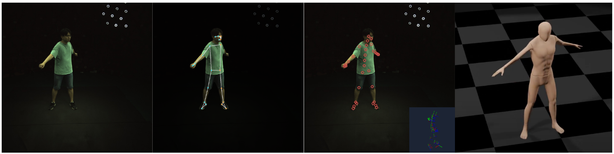

# Assignment 3 - Data-driven inverse kinematics for human motion capture


Hand-in: 20 April 2023, 14:00 CET


----

Leave your name, student ID, ETH email address and the URL link to your motion capture result video here.

- Name:
- Student ID:
- ETH Email:
- URL:

----


In this assignment, we implement markerless human motion capture from multiview videos. 
Our human body is complex, so we leverage a pre-trained human body model, i.e. LISST, to provide body priors and effective regularizations.
Specifically, we provide a codebase, pre-trained models, and pre-processed data, and you implement the most essential parts.

The grading scheme is as follows:
- (50%) Ex 1: Implement the image projection loss, i.e. the data term for motion capture. (`test01.py`)
- (20%) Ex 2: Implement the multistage optimization. (`test02.py`)
- (30%) Ex 3: Implement the temporal smoothness term. (`test03.py`)

Note: If it fails on `test04.py`, plagiarithm is detected.


**IMPORTANT**
- Without the correct image projection loss, you cannot get valid body motion results, and hence cannot proceed with Ex.2 and Ex.3.
Therefore, you will get **zero** point for this assignment if you cannot succeed in Ex 1. 
- Visualization is very important to verify the human motion realism. Therefore, you need to visualize your result based on the code `scripts/vis_ZJUMocap.py` w.r.t. a video, 
and share the video link above. Without this video, you will get **zero** point from this assignment. 
- If A suspected plagiarism case is detected, you will get **zero** point from this assignment.
- After running the code, your results will be stored as `results/mocap_zju_a3/data.pkl`. This is automatically generated by `scripts/app_multiview_mocap_ZJUMocap.py`, and should have the following format
```motion_data = {
    'r_locs': ...,      # LISST body root (pelvis) locations in the world coordinate, with shape (t, 1, 3)
    'J_rotmat': ...,    # LISST joint rotation matrices in world coordinate wrt the canonical rest pose, with shape (t,J,3,3)
    'J_shape': ...,     # LISST bone lengths, with shape (J,)
    'J_locs_3d': ...,   # LISST joint locations in the world coordinate, with shape (t,J,3)
    'J_locs_2d': ...,   # LISST joint locations in indiviual camera views, only available for motion capture results, with shape (t, n_views, J, 2)
}
```
Please push this file as is into your own repo for auto-grading. Please don't change its path and format, otherwise the autograding system will not parse your file correctly.


## Setup
- Download the *Mediapipe Pose* results of the `CoreView_313` sequence [here](https://drive.google.com/drive/folders/1Vfu3vm4_GiZlpGPR2Dwwd56bRxcr1CrD?usp=sharing). You can put them under the `data` folder, e.g.
```
data/1_mediapipe # this folder contains the rendered results of mediapipe
data/cam_params.json # the original camera parameters and names
data/mediapipe_all.pkl # the processed file containing the camera parameters and mediapipe keypoints
```

- Download our pre-trained checkpoints [here](https://drive.google.com/drive/folders/1jcMbJgZtZEHqy-R8e1hjiTkR6V41aX08?usp=sharing). These checkpoints correspond to the model config files.
Please put all the downloaded files to the folder `results/lisst/`.


- Install and setup the LISST model (see the appendix below). To verify your installation, we provide 2 tutorials in `demos/*.ipynb`. This requires you to run `pip install lisst` first. Note that you may need to adapt the file paths and device in this codebase to your own paths. 
  - ***These tutorial scripts are only for self-exploration. You don't have to run them successfully to pass this assignment.***
  - ***To avoid version confliction, please run `pip uninstall lisst` after you finish these two tutorials***.

- If previous steps are successful, you can ***ONLY*** focus on `scripts/app_multiview_mocap_ZJUMocap.py`, because all the implementation tasks are there. In particular, check **TODO!!!** in this file. But you may check other code for comprehensive understanding.
- If the program runs successfully, it will automatically generate the file `results/mocap_zju_a3/data.pkl`. You can manually add it to the repo by `git add -f results/mocap_zju_a3/data.pkl`, and then commit and push.

- Afterwards, you can use `scripts/vis_ZJUMocap.py` to visualize your results, and convert the produced images to a video.

## Ex.1 The loss of body joint projection to images

**Code:**

- Files:
  - `scripts/app_multiview_mocap_ZJUMocap.py`
  
- Functions:
  - `img_project(...)`

**Task:**

- Implement this function.


**Details:**
- The img_project_loss can be formulated as $L(Y,X) = \sum_{j, c} v^c_j |y^c_j - \phi(P^cx_j)|$, in which $x$, $y$, $v$, $P$ and $\phi(\cdot)$ are the 3D location, the 2D detected location, the detected visibility (ranging between 0 and 1), and the projection matrix, respectively. $_j$ and $^c$ denote the joint j and the camera c, respectively.
- You need `generate_img_project_test_file()` to generate the file to pass `test01`. 
- To test, you can run `pytest tests/test01.py` locally before committing to the repo. By submitting, you need to add `data/test_img_project_loss_data2.npy` to the repo.


## Ex.2 Multistage optimization

**Code:**

- Files:
  - `scripts/app_multiview_mocap_ZJUMocap.py`
  
- Functions:
  - some missing code blocks in `recover()`.
  - check `TODO!!! Ex.2`.

**Task:**

- Implement the multistage optimization.


**Details:**
- Inverse kinematics is a highly ill-posed problem. A good initialization is essential.
- In early stages, we only optimize the body global parameters.
- In late stages, we optimize both the global and the local body parameters.
- Multistages can be implemented by enabling/disabling updating certain variables.
- After implementation, you should be able to get `results/mocap_zju_a3/data.pkl`. You could use `test02.py` to verify.


## Ex.3 Temporal smoothness regularization

**Code:**

- Files:
  - `scripts/app_multiview_mocap_ZJUMocap.py`
  
- Functions:
  - check `loss_smoothness` or `TODO!!! Ex.3`  in the function `recover()`.

**Task:**

- Implement the temporal smoothness loss.


**Details:**
- Human motion is smooth. Without this loss, obvious discontinuities are in the result.
- The smoothness loss can be formulated as $L = \sum_{j, t} |x^t_j - x^{t-1}_j|$ to penalize the velocity of the 3D joint locations. In addition, temporal smoothness can also be applied to rotations. Think of how they are implemented.
- After implementation, you should be able to get `results/mocap_zju_a3/data.pkl`. You could use `test03.py` to verify.


## Final Note

- We will release our offcical code after the deadline of assignment 3. Further announcements will be sent.
- Your result should also pass `test04.py`.


----

----

----

# APPENDIX: Linear Shaped Skeletons for Human Body Modelling




**LISST** is a *light-weight*, *differentiable*, and *parametric* human body model focusing on skeletons. Its down-streaming applications cover **markerless motion capture**, **motion synthesis and control**, **sports**, **game development**, **healthcare**, and beyond.
We further create an extension package [LISST-blender](https://github.com/yz-cnsdqz/LISST-blender) to use our model for character animation and motion re-targeting.


Provided the `body shape`, `body pose`, and `root configurations`, a posed body skeleton is produced via forward kinematics, and is placed in the world space.
We employ the [CMU Mocap](http://mocap.cs.cmu.edu/) dataset to build the body skeleton, learn the shape spaces, pose priors, and others.
Beyond the 31 body joints in CMU Mocap, additional bones are incorporated into the kinematic tree and the shape space, based on human anatomical statistics.


# Notice
- This version is to provide a framework for Assignment 3 of the course [Digital Humans 2023](https://vlg.inf.ethz.ch/teaching/Digital-Humans.html) at ETH Zurich. 
- CPU-only version is already tested and works for the tasks of A3.
- Code, data, and model will be updated in future versions.
- [The official tutorial slides are here.](https://docs.google.com/presentation/d/1n9_FWMsHK-Iej1kg661XKpPUYipbXGGwX8pEMvK7uZo/edit?usp=sharing)


# Installation

**First**, create a virtual environment by running
```
python3 -m venv {path_to_venv}
source {path_to_venv}/bin/activate
```

**Second**, install all dependencies by running
```
pip install -r requirements.txt
```
Note that other versions might also work but not are not tested. 
In principle, this codebase is not sensitive to the Pytorch version, so please use the version that fits your own CUDA version and the GPU driver. Note that you may encounter errors like 
```
ERROR: jupyter-packaging 0.12.3 has requirement setuptools>=60.2.0, but you'll have setuptools 44.0.0 which is incompatible.
ERROR: ypy-websocket 0.8.4 has requirement y-py<0.7.0,>=0.6.0, but you'll have y-py 0.5.9 which is incompatible.
```
Ignore them for now.


